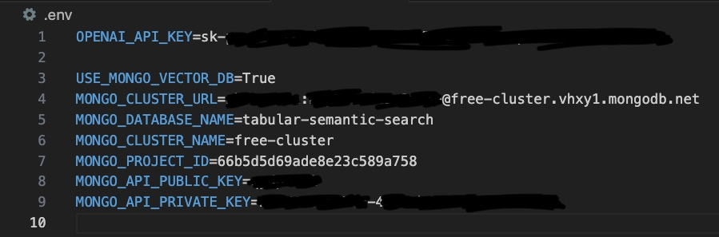

# 🚀 Installation and Usage Guide

Get up and running with our Amazon tabular semantic search engine in minutes.

# 📋 Prerequisites

## Local Setup

Install these tools on your machine:

| Tool | Purpose | Version | Download Link | Notes |
|------|---------|---------|---------------|--------|
| Python | Programming language runtime | = v3.11 | [Download](https://www.python.org/downloads/) | Core runtime environment |
| uv | Python package installer and virtual environment manager | >= v0.4.30 | [Download](https://github.com/astral-sh/uv) | Modern replacement for pip/venv/poetry |
| GNU Make | Build or task automation tool | >= v3.81 | [Download](https://www.gnu.org/software/make/) | Used for running project commands |
| MongoDB Atlas CLI | Interact with MongoDB Atlas from the CLI | >= v1.33.0 | [Download](https://www.mongodb.com/docs/atlas/cli/current/install-atlas-cli/) | Used for hosting the vector DB |  

## Cloud Services

You'll need access to:

| Service | Purpose | Cost | Required Environment Variables | Setup Guide |
|---------|---------|------|---------------------|-------------|
| [OpenAI API](https://openai.com/index/openai-api/) | LLM API | Pay-per-use | `OPENAI_API_KEY`<br>`OPENAI_MODEL_ID` | [Quick Start Guide](https://platform.openai.com/docs/quickstart) |
| [MongoDB Atlas](https://www.mongodb.com/products/platform/atlas-database) | Vector DB | Free tier | `USE_MONGO_VECTOR_DB`<br>`MONGO_CLUSTER_URL`<br>`MONGO_DATABASE_NAME`<br>`MONGO_CLUSTER_NAME`<br>`MONGO_PROJECT_ID`<br>`MONGO_API_PUBLIC_KEY`<br>`MONGO_API_PRIVATE_KEY` | 1. [Create a free MongoDB Atlas account](https://www.mongodb.com/cloud/atlas/register) <br> 2. [Create a Cluster](https://www.mongodb.com/docs/guides/atlas/cluster/) </br> 3. [Add a Database User](https://www.mongodb.com/docs/guides/atlas/db-user/) </br> 4. [Configure a Network Connection](https://www.mongodb.com/docs/guides/atlas/network-connections/) </br> 5. [Create an API Key](https://docs.superlinked.com/run-in-production/index-1/mongodb#creating-the-api-key) </br> 6. [Create an empty database](https://docs.superlinked.com/run-in-production/index-1/mongodb#creating-the-database) |

> **Note:** Find all the required environment variables in the `.env.example` file.

# 💻 Setup in 3 Steps

## 1. Install Dependencies

Set up the project environment by running the following:
```bash
make install
```
Test that you have Python 3.11.8 installed in your new `uv` environment:
```bash
uv run python --version
# Output: Python 3.11.8
```

This command will:
- Create a virtual environment using `uv`
- Activate the virtual environment
- Install all dependencies from `pyproject.toml`

> [!NOTE]
> Normally, `uv` will pick the right Python version mentioned in `.python-version` and install it automatically if it is not on your system. If you are having any issues, explicitly install the right Python version by running `make install-python`

## 2. Configure Environment

Before running any components:
1. Create your environment file:
   ```bash
   cp .env.example .env
   ```
2. Open `.env` and configure the required credentials following the inline comments (see [superlinked_app/config.py](superlinked_app/config.py) for all options).

<p align="center">
  
</p>

> [!IMPORTANT]
> For quick testing, set `USE_MONGO_VECTOR_DB=False` to use an in-memory database, otherwise follow `Step 3`.

## 3. Configure Vector Search with MongoDB Atlas

Follow these steps to set up MongoDB Atlas for scalable vector search and get all required environment variables. 

> [!TIP]
> If you are more comfortable with a UI, you can also follow the steps from [📋 Prerequisites -> Cloud Services -> MongoDB Atlas](#-prerequisites--cloud-services), which do the same thing.

1. **Create Account & Install CLI**

- [Create a free MongoDB Atlas account](https://www.mongodb.com/cloud/atlas/register)
- [Install MongoDB Atlas CLI](https://www.mongodb.com/docs/atlas/cli/current/install-atlas-cli/)

[📚 More on getting started with MongoDB Atlas](https://www.mongodb.com/docs/atlas/tutorial/create-atlas-account/)

2. **Login to Atlas CLI**

```bash
atlas auth login
```

3. **Create Free Cluster**

Create an M0 (free) cluster in AWS EU West region:
```bash
atlas clusters create free-cluster --provider AWS --region EU_WEST_1 --tier M0
```
Wait for cluster creation to complete and list available clusters:
```bash
atlas clusters watch free-cluster
atlas clusters list
```

Set `MONGO_CLUSTER_NAME=free-cluster` environment variable.

> [!IMPORTANT]
> The free M0 cluster has limitations but is sufficient for testing.

4. **Create Database User**

Create database user:
```bash
atlas dbusers create --username <your_mongo_database_user> --password <your_mongo_database_password> --role readWriteAnyDatabase
```

List users:
```bash
atlas dbusers list
```
These credentials will be used in the `MONGO_CLUSTER_URL` env var.

5. **Configure Network Access**

Option 1: Allow access from anywhere (ease of use for development):
```bash
atlas accessList create "0.0.0.0/0" --type ipAddress --comment "Allow access from anywhere"
```
Option 2: Allow only your IP (recommended):
```bash
atlas accessList create --currentIp
```
To list current access list entries:
```bash
atlas accessList list
```

> [!IMPORTANT]
> For production, restrict network access to specific IPs.

6. **Create API Keys**
Create API key with required permissions:
```bash
atlas organizations apiKeys create --desc "Full Access API Key for 'tabular-semantic-search' project" --role ORG_OWNER --role ORG_MEMBER --role ORG_GROUP_CREATOR --role ORG_READ_ONLY
```

List keys to get the public key:
```bash
atlas organizations apiKeys list
```

Set: 
- `MONGO_API_PUBLIC_KEY`: Public key from the created API key
- `MONGO_API_PRIVATE_KEY`: Private key shown during creation (save it immediately)

> [!IMPORTANT]
> Save your API private key immediately after creation - it cannot be retrieved later.

7. **Setting Remaining Environment Variables**
Set `MONGO_PROJECT_ID`:
```bash
atlas projects list
```

Set `MONGO_CLUSTER_URL`:
bash
```
atlas clusters connectionStrings describe free-cluster
```
Now set the environment variables as (without `mongodb+srv://`) `MONGO_CLUSTER_URL={YOUR_DATABASE_USER}:{YOUR_DATABASE_PASSWORD}@free-cluster.vhxy1.mongodb.net`, where the database user and password are the ones created at point 4.

8. **Create Database**
Creates the database specified in MONGO_DATABASE_NAME:
```bash
make create-mongodb-database
```

> [!IMPORTANT]
> If you are getting `SSL handshake errors,` turn off your VPN or firewall or try using a different network.

Now go to [MongoDB Atlas](https://cloud.mongodb.com/) -> Clusters -> Browse Collections and check that your database was created successfully.

Your final `.env` file should have these MongoDB-related variables:
```bash
USE_MONGO_VECTOR_DB=True
MONGO_CLUSTER_URL=username:password@free-cluster.xxxxx.mongodb.net
MONGO_DATABASE_NAME=your_database_name
MONGO_CLUSTER_NAME=free-cluster
MONGO_PROJECT_ID=your_project_id
MONGO_API_PUBLIC_KEY=your_public_key
MONGO_API_PRIVATE_KEY=your_private_key
```

## 4. Load and Process Your Data

The first step is to download and process the dataset sample:
```bash
make download-and-process-sample-dataset
```

We also support the complete dataset, but you need a powerful computer, good internet and patience to run everything on it:
```bash
make download-and-process-full-dataset
```

You should see this structure in your `data` folder:
```text
data/
├── processed_100_sample.jsonl
├── processed_300_sample.jsonl
├── processed_850_sample.jsonl
├── sample.json
└── sample.json.gz
```

# ⚡️ Explore & Run

## 🔍 Interactive Notebooks

| Notebook | Description |
|----------|-------------|
| [Dataset Exploration](1_eda.ipynb) | Dive into the Amazon ESCI dataset |
| [Semantic Search Demo](2_tabular_semantic_search_superlinked.ipynb) | See Superlinked in action |
| [Text-to-SQL Examples](3_tabular_semantic_search_text_to_sql.ipynb) | Try LlamaIndex queries |

## 🚀 Launch the Superlinked Server and MongoDB Vector Database

1. Start it up:
```bash
make start-superlinked-server
```
FastAPI endpoints docs available at `http://localhost:8080/docs`

2. From a different terminal, load your data:
```bash
make load-data
```
**Note:** Give it a few minutes before running the queries (~10-15 minutes)

3. Try some queries:
```bash
make post-filter-query     
make post-semantic-query   
make similar-item-query
```

4. Start the Streamlit UI:
```bash
make start-ui
```
Accessible at `http://localhost:8501/`

> 🔔 Make sure the data finished loading before excuting any queries.