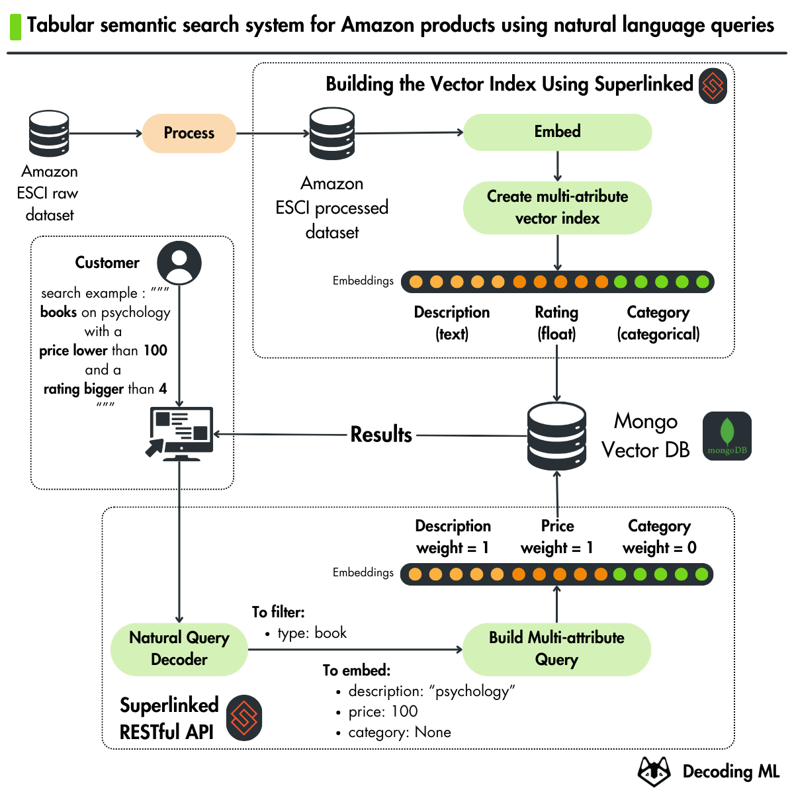
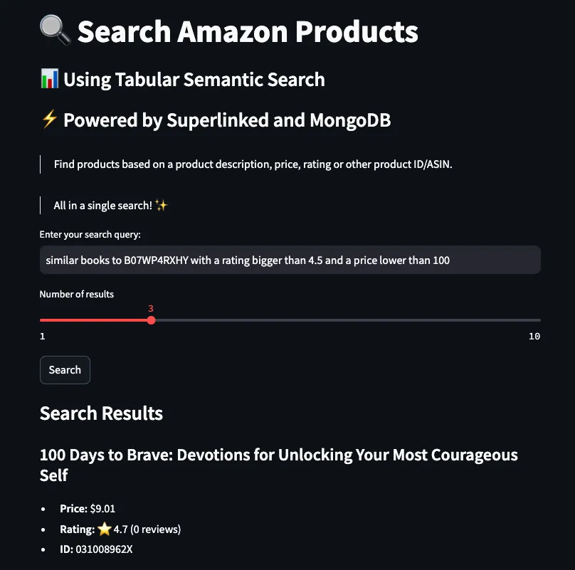

<div align="center">
  <h1>Hands-on Amazon Tabular Semantic Search</h1>
  <p class="tagline">Open-source series by <a href="https://decodingml.substack.com">Decoding ML</a> in collaboration with <a href="https://rebrand.ly/superlinked-homepage">Superlinked</a> and <a href="https://rebrand.ly/mongo-atlas-vector-search">MongoDB</a>.</p>
</div>

<p align="center">
  
</p>

## 🎯 What You'll Build

A production-ready tabular semantic search system for Amazon e-commerce products that enables natural language queries. 

<div align="center">
  <table>
    <tr>
      <td align="center"><b>🔍 Core Features</b></td>
      <td align="center"><b>🛠️ Tech Stack</b></td>
    </tr>
    <tr>
      <td>
        • Semantic search for tabular data<br/>
        • Natural language query processing<br/>
        • Multi-attribute vector indexing<br/>
        • RESTful API endpoints<br/>
        • Tabular semantic search vs. text-to-SQL<br/>
        • Interactive web interface
      </td>
      <td>
        • OpenAI LLMs<br/>
        • MongoDB Atlas Vector Search<br/>
        • Superlinked<br/>
        • FastAPI<br/>
        • LlamaIndex<br/>
        • Streamlit
      </td>
    </tr>
  </table>
</div>

Perfect for developers building search functionality in e-commerce or structured data applications.

## 🎓 Prerequisites

| Category | Requirements |
|----------|-------------|
| **Skills** | Basic knowledge of Python. |
| **Hardware** | Any modern laptop/workstation will do the job (no GPU or powerful computing power required). |
| **Level** | Beginner |

## 💰 Cost Structure

All tools used throughout the course will stick to their free tier, except OpenAI's API, which will cost you <1$ to run all our examples.


## 📚 Articles

Our recommendation for each article:

- Read the article.
- Run the Notebook and the code using the [INSTALL_AND_USAGE](INSTALL_AND_USAGE.md) docs.
- Go deeper into the code

| No. | Article | Description | Notebooks | Python code |
|--------|---------|-------------|-----------------|-----------------|
| 1 | Forget text-to-SQL: Use this natural query instead (WIP) | Learn to build a tabular semantic search RESTful API server that enables natural language queries. | • [1_eda.ipynb](1_eda.ipynb)</br>• [2_tabular_semantic_search_superlinked.ipynb](2_tabular_semantic_search_superlinked.ipynb) | `superlinked_app` |
| 2 | Tabular semantic search vs. text-to-SQL (WIP)| Deep dive into how tabular semantic search works and what it offers in addition to text-to-SQL strategies. | • [3_tabular_semantic_search_text_to_sql.ipynb](3_tabular_semantic_search_text_to_sql.ipynb) | `superlinked_app` |

## 🏗️ Project Structure

```text
.
├── data/                                          # Directory where dataset files and processed data will be downloaded.
├── superlinked_app/                               # Main application source code
├── tools/                                         # Utility scripts and helper tools
├── .env                                           # Environment variables for local development
├── .env.example                                   # Template for environment variables
├── 1_eda.ipynb                                    # Notebook for Exploratory Data Analysis for the Amazon dataset
├── 2_tabular_semantic_search_superlinked.ipynb    # Demo notebook for Superlinked tabular semantic search
├── 3_tabular_semantic_search_text_to_sql.ipynb    # Examples of text-to-SQL queries
├── Makefile                                       # Running commands shortcuts
├── pyproject.toml                                 # Python project dependencies and metadata
└── uv.lock                                        # Lock file for uv package manager
```

## 💾 Dataset

We will use the [ESCI-S: extended metadata for Amazon ESCI dataset](https://github.com/shuttie/esci-s?tab=readme-ov-file) dataset released under the Apache-2.0 license.

It is an e-commerce dataset on Amazon products. 

The full dataset references ~1.8M unique products. We will work with a sample of 4400 products to make everything lighter, but the code is compatible with the whole dataset.

📚 Read more on the [ESCI-S dataset](https://github.com/shuttie/esci-s?tab=readme-ov-file)

💻 Explore it in our [Dataset Exploration](1_eda.ipynb) Notebook.


## 🚀 Getting Started

For detailed installation and usage instructions, see our [INSTALL_AND_USAGE](INSTALL_AND_USAGE.md) guide.

**Recommendation:** While you can follow the installation guide directly, we strongly recommend reading the accompanying articles to gain a complete understanding of the series.

<p align="center">
  
</p>

## 💡 Questions and Troubleshooting

Have questions or running into issues? We're here to help!

Open a [GitHub issue](https://github.com/decodingml/hands-on-retrieval/issues) for:
- Questions about the series material
- Technical troubleshooting
- Clarification on concepts

## Sponsors

<table>
  <tr>
    <td align="center">
      <a href="https://rebrand.ly/superlinked-homepage" target="_blank">Superlinked</a>
    </td>
    <td align="center">
      <a href="https://rebrand.ly/mongo-atlas-vector-search" target="_blank">MongoDB</a>
    </td>
  </tr>
  <tr>
    <td align="center">
      <a href="" target="_blank">
        
      </a>
    </td>
    <td align="center">
      <a href="" target="_blank">
        
      </a>
    </td>
  </tr>
</table>

## License

This course is an open-source project released under the MIT license. Thus, as long you distribute our LICENSE and acknowledge your project is based on our work, you can safely clone or fork this project and use it as a source of inspiration for your educational projects (e.g., university, college degree, personal projects, etc.).